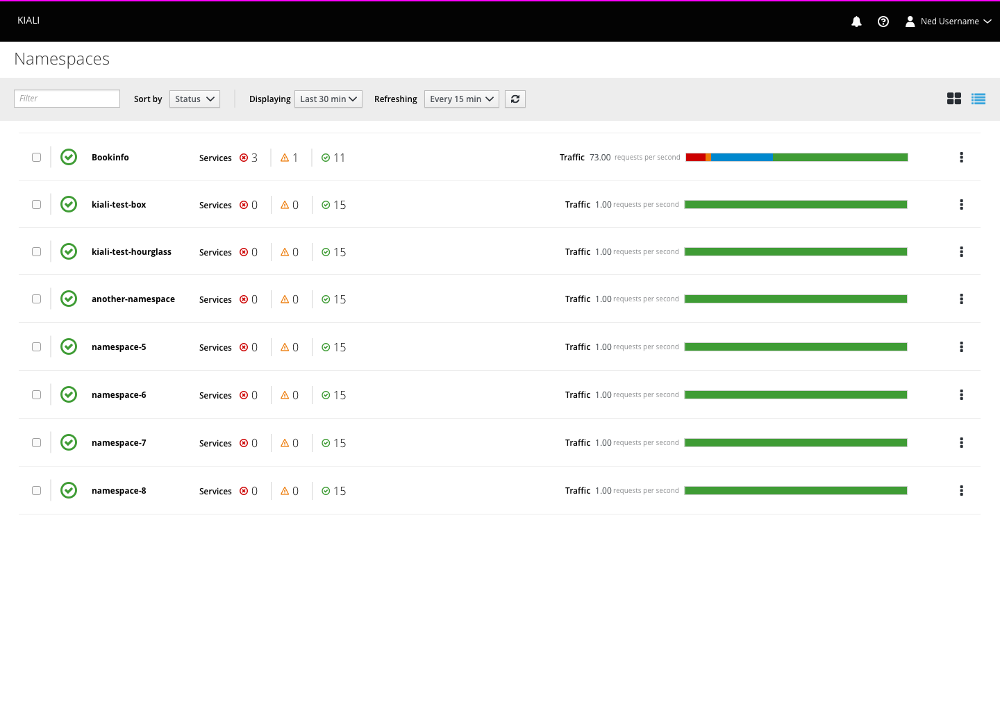
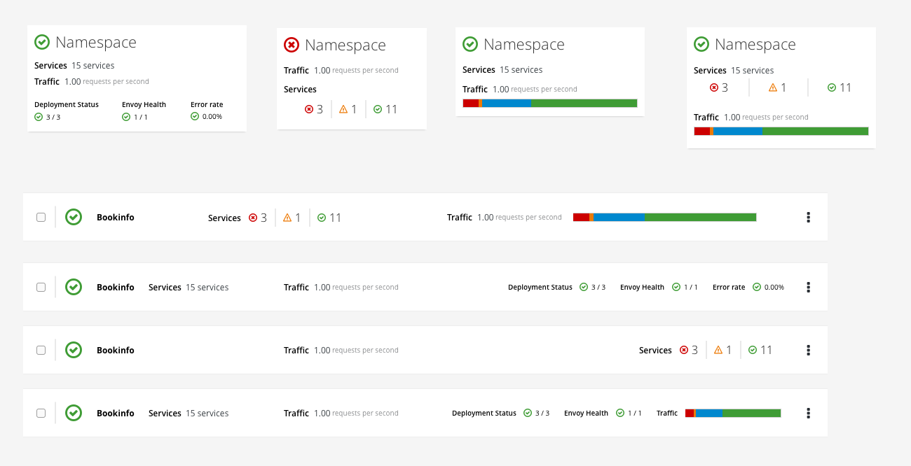

# Namespace Overview

## Summary
The namespace overview would give a high-level summary of the health of each namespace (or composite) as well as some other basic information.

## Card View

- Namespaces could be shown with their name and a rollup of their overall health as well as any of several different metrics

## List View

## Alternative Namespace Representations

- Stats we could include
  - Total number of services
  - Component pieces of namespace health
  - Summary of service status
  - Traffic information
  - Stats about services with ingresses
  
