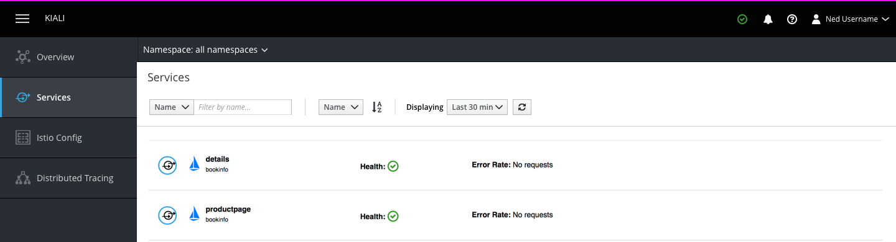
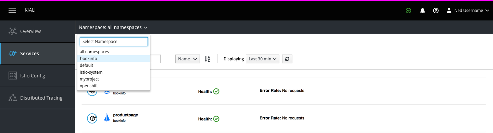
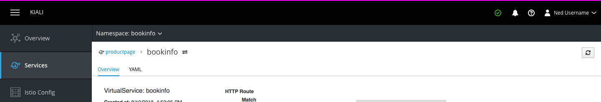
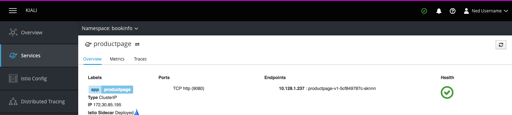
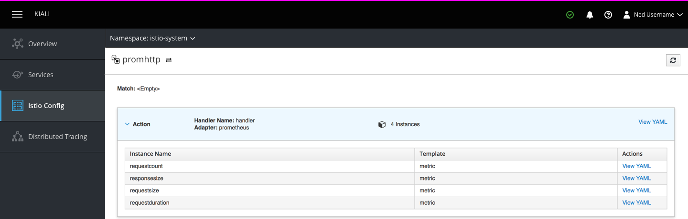
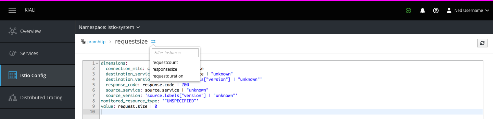
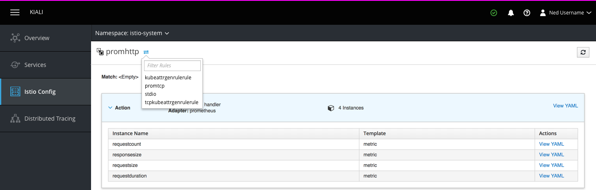
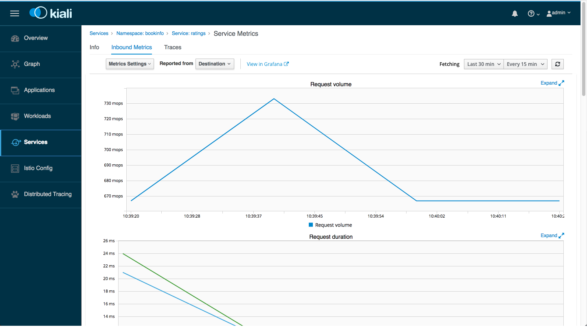

# Navigation

## Scope Selector

- The scope selector is a dropdown just below the masthead the enables users to focus their work on a specific namespace. In the future, this selector could be used to select from a number of logical groups created by the user.

- When a single object is selected, the scope selector changes to show the namespace of that object. Navigating back to non-namespace-specific page such as a list or graph view page changes the selector back to `all namespaces` unless the scope selector was manually set to a specific namespace previously.

## Breadcrumbs

- Breadcrumbs link the current page to its parent in order to show the relationships between objects and provide a way to navigate to intermediate levels of hierarchy that aren't easily reachable from the main navigation.
- Breadcrumbs only contain the names of specific objects and not navigation items, object types, or the name of the active page section.
- If an object has an associated icon, that icon is included to the left of the object name when it appears as either a breadcrumb or a page title.

- If the current object does not have any parent objects, the leaf of the breadcrumb is used as the page title.
- **Note:** Information that could be used to navigate to filtered list views (such as object type or label) should be included in the Overview section of object list pages rather than in the breadcrumb.

### Breadcrumb switcher

- The Breadcrumb Switcher provides a shortcut for users to quickly navigate to parallel pages, rather than navigating back to the previous page and making a new selection.

- Clicking on the switcher displays a dropdown with a list of items parallel to the one displayed on the current page.
  - For example, when viewing a rule instance, clicking on the switcher would display a list of other instances of that rule and enable the user to navigate to them.

- In the case of items within the "Istio Config" section, the dropdown should contain only objects of the same type (Rule, virtualService, etc.)

### Metrics page - link to Grafana dashboard

Link to Grafana dashboard should be present at the top of the Metrics page
