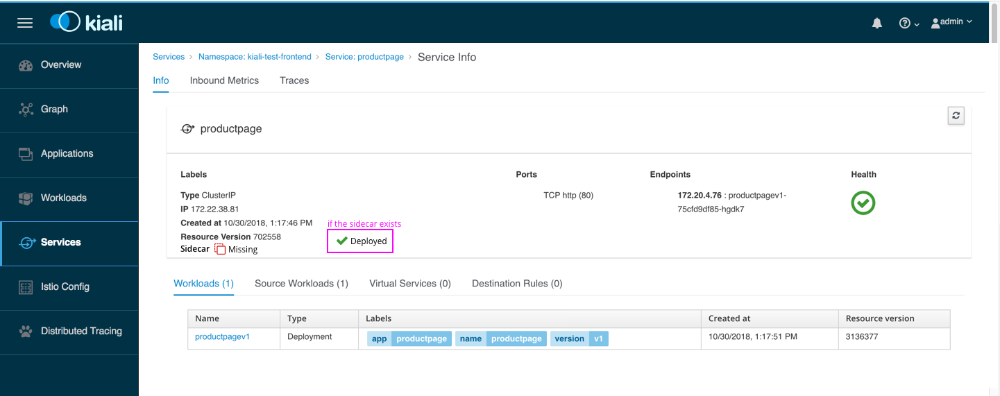
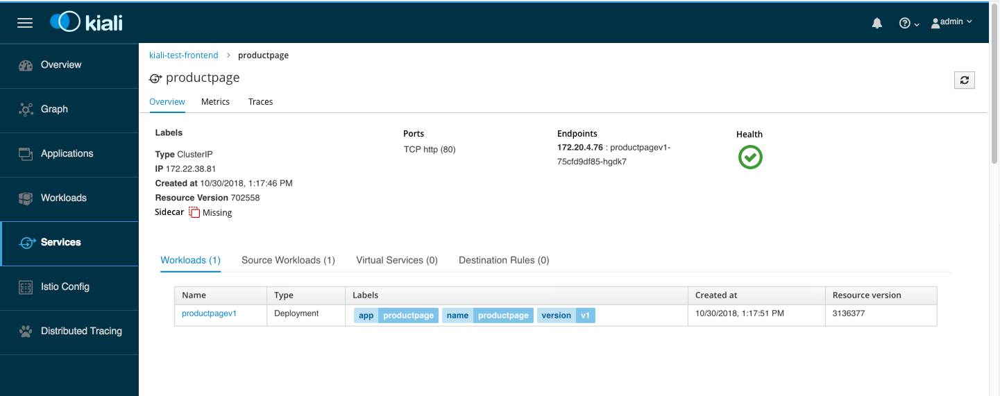
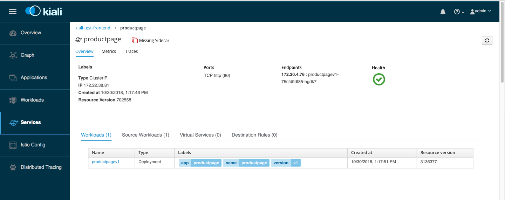
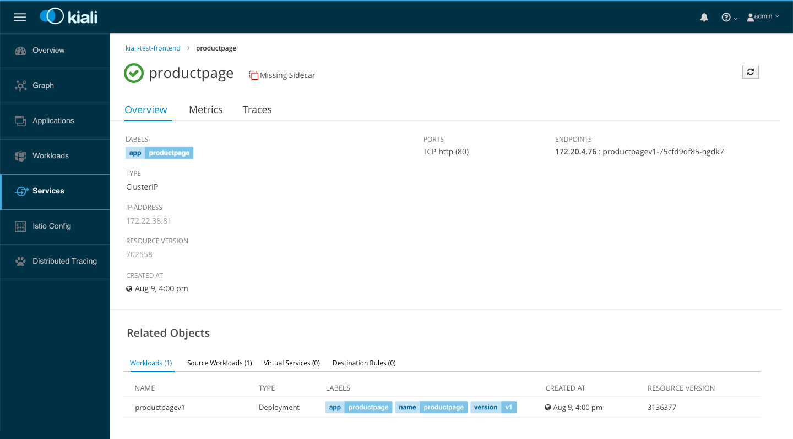
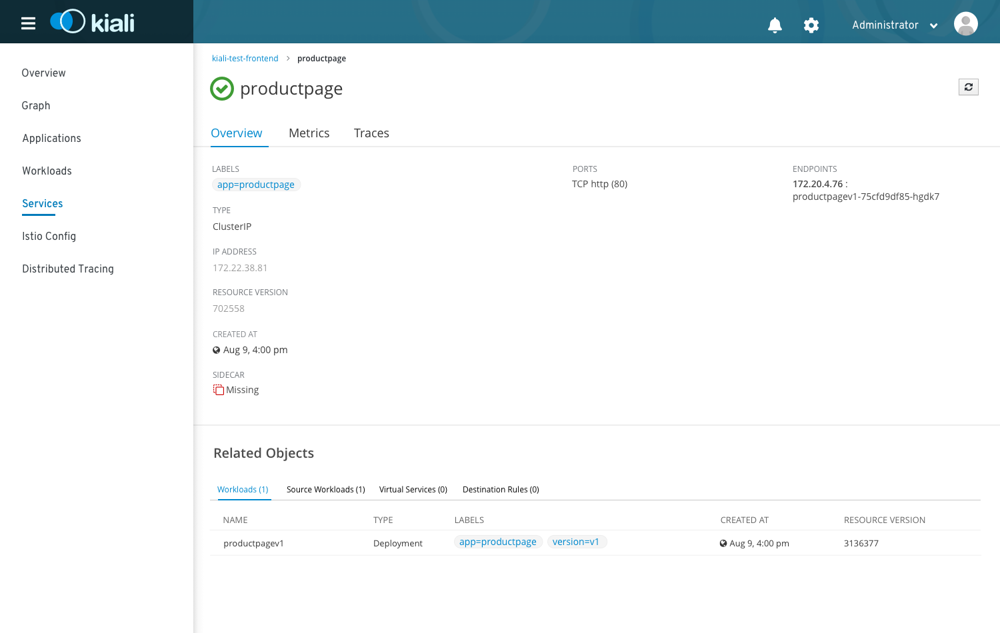

# Object details

## Sidecar field

- We could add a `sidecar` field to the item details to illustrate whether the sidecar is missing or represent

## Minor page structure improvements
These changes should be relatively simple to make, but improve the information hierarchy of object details pages.

- Move page title and refresh button to above tabs
- Remove extraneous items from breadcrumbs
- Remove card border from object details

- This structure would make it more appropriate to include states like "missing sidecar" in the header of the page

## Moderate style changes
Adds more space to the page and brings it in line with other cloud software

- Change font and table styling
- Move health into header (details still available on hover)
- More space for ports and endpoints lists

## Big changes big difference
PatternFly 4 style navigation and header lead to a very different appearance

