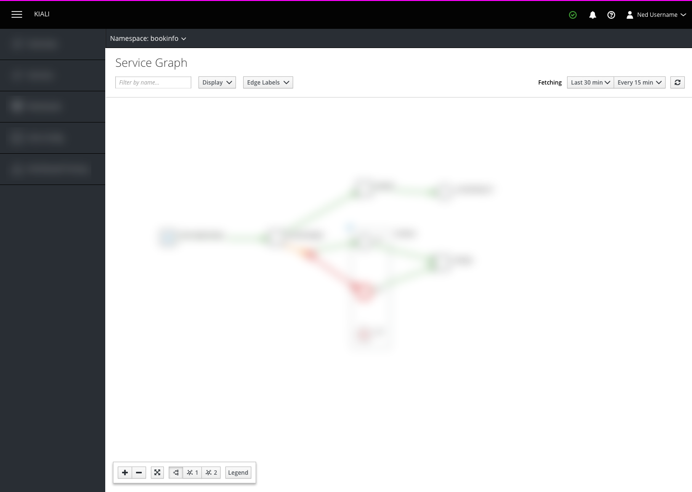

# Service Graph

## Graph Controls

### Display Settings
The display settings control which graph elements are shown and hidden on the graph

- **Application Groups:** Toggles between showing workloads only and showing workloads as well as labeled applications **Note:** If a workloads-only view is deemed unnecessary, this checkbox could be removed  as it would effectively always be checked in this case.
- **Application Versions:** Shows all applications as collapsed shapes when unchecked, and shows application versions inside of application rectangles when checked.

### Edge Labels
Controls what information is shown on the graph's edges

### Fetching Settings
Controls how much and how often data is retrieved. Also enables the user to manually fetch data.

### Zoom Tool
The graph zoom tool contains buttons that enable the user to zoom the graph in and out as well as fit the zoom to the current view. This tool may optionally contain a trigger for the graph legend as well as a graph layout selector.

- **Zoom in:** Zooms the graph by a factor of 2 (e.g. 50% => 100%, 100% => 200%)
- **Zoom out:** Zooms the graph by a factor of .5 (e.g. 200% => 100%, 100% => 50%)
- **Zoom to fit:** Zooms the graph to fit the current viewport size
- **Legend:** Shows and hides the graph legend
- **Graph layout toggle:** The graph zoom tool could optionally include buttons to toggle the graph layout. This should only be done if all available graph layouts are able to be described by icons or some other extremely short identifier.

## Legend
The graph legend appears when the legend trigger button is clicked and contains a brief overview of the possible items that a user may encounter on the graph. If technically possible, this legend should be draggable around the viewport so that it does not obscure important details. If that is not technically possible, the legend should be fixed in the bottom left corner of the viewport.

### Legend Details

1. **Legend Title**
1. **Documentation Link:** links to an external page of documentation that describes all the graph elements in detail
1. **Close Button:** Dismisses the legend. Clicking on the legend trigger button again will also dismiss the legend
1. **Key:** Contains all of the shapes and colors that have meaning on the graph and labels each with a succinct, descriptive phrase.

## Graph Nodes and Edges

Nodes in the service graph are colored according to their health. Borders are 1px wide for unselected nodes and 3px for selected nodes. Graph edges are colored similarly, with 1px lines when unselected, and 3px lines when selected. There is no separate hover state for graph edges, but items not directly connected to the hovered edge should be blurred into the background.

### Healthy

- Grey Stroke: #8b8d8f (pf-black-500)
- White Fill: #ffffff (pf-white)
- Blue Stroke: #39a5dc (pf-blue-300)
- Blue Fill: #def3ff (pf-blue-50)
- Green Stroke: #3f9c35 (pf-green-400)

### Warning

- White Fill: #ffffff (pf-white)
- Orange Stroke: #ec7a08 (pf-orange)
- Orange Fill: #fdf2e5

### Error

- White Fill: #ffffff (pf-white)
- Red Stroke: #cc0000 (pf-red)
- Red Fill: #ffe6e6

### Idle

- Grey Stroke: #8b8d8f (pf-black-500)

### Unused

- Grey Stroke: #8b8d8f (pf-black-500)
- White Fill: #ffffff (pf-white)
- Blue Stroke: #39a5dc (pf-blue-300)
- Blue Fill: #def3ff (pf-blue-50)

### TCP Traffic

- Dark Blue Stroke: #004368 (pf-blue-600)

## Traffic Animation options

### Normal traffic
  

  

  

### Failed request
  

  
