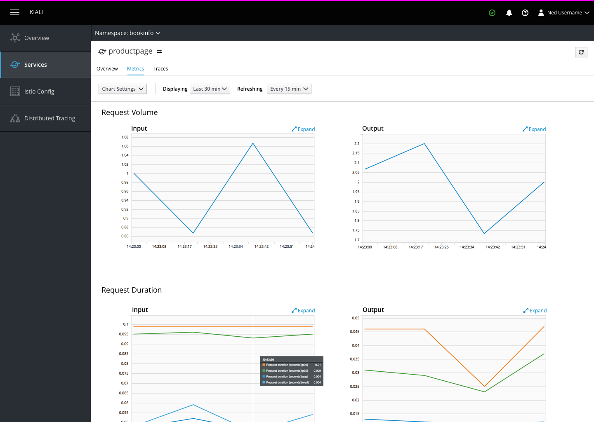
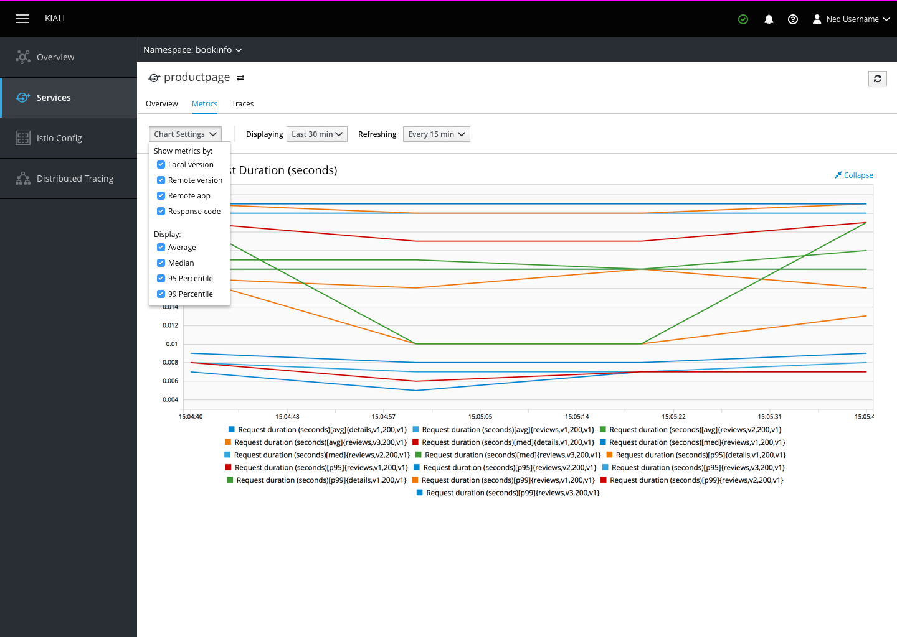

# Services

## Metrics

- Service metrics charts are grouped by the metric that they represent and displayed on cards next to one another.
- Chart legends are visible below the charts as well as by hovering over the graph.
- The height of each pair of charts should be matched so thh
- Adding the option to show different percentiles into the settings dropdown would effectively enable people to replicate the hiding and showing feature of the legend for every graph at once rather than one at a time.
- Charts should be displayed at a fixed height, but if this is not possible/practical both charts in each pair should have the same height.

### Expanded Metrics Chart

- Clicking the `expand` action on a given chart expands it to the full with of the page and displays the chart legend.
- The `collapse` action returns the user to the full list of charts. Leaving the page and returning should also display the full list.
- Clicking on items in the legend would hide and show individual lines on the graph.
